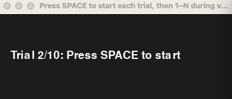
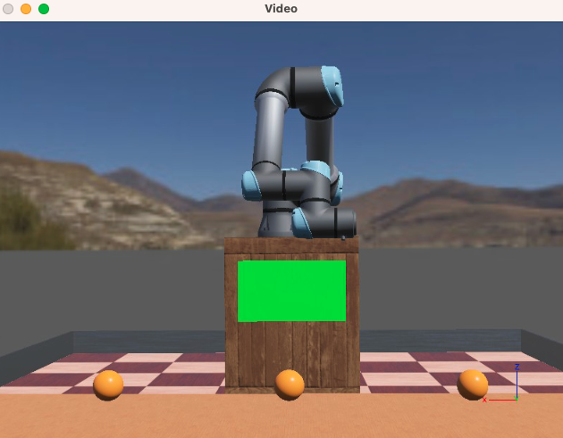

# hri_final_project

HRI Final Project by Sylvia Chang and Rui Wen

This project combines a Webots simulation of a UR5e robot with a Jupyter-based behavioral experiment.
All source code, Webots assets, and experiment materials are included in this repository.

## Project Components

### `Robot` - `Webots\`

The robot controller drives a Supervisor-enabled UR5e arm in Webots.
It automatically detects all Ball nodes in the world and moves the robot to each ball using a numeric inverse kinematics (IK) method.

Controller: `ure5_TEST.py`

1. **Robot Initialization**:
   - Creates a Supervisor() controller and connects to 4 motor devices + sensors.
   - Sets initial joint positions and motor velocities.
2. **Scene Parsing**:
   - Scans root-level Webots nodes.
   - Finds every Ball node and reads its world-frame position.
3. **Coordinate Transformations**:
   - Converts each ball’s world coordinates → robot base frame.
4. **Forward Kinematics(FK)**:
   - Computes the end-effector 3D position using a simplified UR-style kinematic chain.
   - Uses joint sensor readings each simulation step.
5. **Numerical Jacobian**:
   - Estimates a 3×3 Jacobian (for the shoulder and elbow joints) using central differences.
6. **Inverse Kinematics(IK)**:
   - Performs a damped-least-squares (DLS-like) IK update.
   - Applies temporal smoothing and command blending for stable motion.
7. **Motion Execution**:
   - Adds an approach offset so the robot moves above the ball instead of colliding with it.
   - Runs IK iteratively until the target is reached.
   - Returns the arm to a predefined starting pose before moving to the next ball.

Environment setting: `Test3.wbt`

- You can freely modify the number and positions of balls without changing the controller.

### `Experiment` - `RandomizationProgram.ipynb`

This Jupyter notebook is used for running human-subject experiments.
It measures reaction time and accuracy as participants predict which ball the robot will reach.

1. User presses Space to start the trial video.
2. User presses the number key corresponding to the ball(counting from left → right) that they believe the robot will reach.
3. After running all trials, reaction time and correctness are logged for analysis.

Configurable Parameters: These allow testing different visual cue conditions.

- num_balls: [3, 5, 7]
- type_visual: ["none","arrows","eyes","text"]

## How to run

### `Robot`

Requirements: Webots (R2025a or similar) with Python controller support.

1. Place `ure5_TEST.py` in your Webots controllers folder.
2. Open the `Test3.wbt` world in Webots.
3. (Optional) Add visual cues from the `VisualAssets/` folder to the SolidBox in the scene.

### `Experiment` - `RandomizationProgram.ipynb`

Requirements: A Python environment with Jupyter Notebook installed.

1. Open RandomizationProgram.ipynb.
2. Run all cells.
3. Follow on-screen instructions to collect participant responses.
